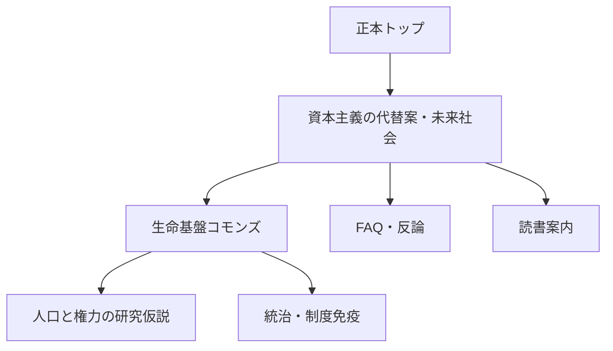

# 凪プロジェクト 検索・発見性戦略

更新日: 2026-08-13
対象: Googleなどの検索、ChatGPT SearchなどのLLM検索、サイト内の思想体系と導線

## 結論

凪はすでに固有名詞と独自概念では検索に掲載されている。したがって、GitHub Pagesだから検索対象外になっているのではない。

現在の主要課題は、次の三つである。

1. 「資本主義の代替案」「未来の社会」という一般検索意図と、凪の既存ページの言葉が十分に一致していなかった。
2. 正本ではAIを任意の補助手段としているのに、一部の制度ページではAIが生命基盤の責任主体であるように読めた。
3. `rmikar.github.io/nagi-project/` はサブディレクトリ型サイトであり、検索結果上の独立したサイト名、ブランド、ファビコンを確立しにくい。

短期は既存ページを検索意図に合わせて強化し、中期は独自ドメインと外部からの参照を整える。似た検索ページを量産せず、正本と主要入口へ評価を集める。

## 現在地

2026-08-13の公開検索では、次の状態を確認した。

- 「凪プロジェクト」「生命基盤コモンズ」などの固有語では公開ページが検索結果に出る。
- `future_social_philosophy.html`、`vital_commons.html`など複数の下層ページもクロール・インデックスされている。
- 「資本主義の代替案」「未来の社会」の一般検索では、大学、研究機関、企業メディア、既存思想の解説が中心で、凪は目立っていない。

これはホスティングによる一律の除外ではなく、一般語に対する関連性、外部評価、サイトの独立ブランド、公開期間の短さが主な課題であると考えるのが妥当である。

## GitHub Pagesは検索上不利か

### 直接的なペナルティは確認できない

Googleの公式ガイドは、ドメイン名やURL内のキーワード自体がランキングへ与える効果は小さいとしている。GitHubも、公開コンテンツを検索エンジンにインデックスさせる用途としてGitHub Pagesを案内している。実際に凪の複数ページがインデックスされているため、`github.io`だから低品質と一律判定されているとは考えにくい。

→ [Google SEO Starter Guide](https://developers.google.com/search/docs/fundamentals/seo-starter-guide) \
→ [What is GitHub Pages?](https://docs.github.com/en/pages/getting-started-with-github-pages/what-is-github-pages)

### ただし、間接的な弱点はある

現在のURLは `rmikar.github.io` の下の `/nagi-project/` である。Googleは、サブディレクトリ単位の独立したサイト名をサポートしていない。また、検索結果のファビコンもホスト名単位で扱われる。凪が独立した思想プロジェクトであることを検索画面だけで伝える点では不利である。

→ [Google: Site names](https://developers.google.com/search/docs/appearance/site-names) \
→ [Google: Define a favicon](https://developers.google.com/search/docs/appearance/favicon-in-search)

独自ドメインは自動的に順位を上げる魔法ではないが、次の利点がある。

- サイト名を「凪プロジェクト」として確立しやすい。
- URLが短く、共有、引用、記憶がしやすい。
- ファビコン、ブランド、Search Consoleのプロパティを独立させやすい。
- GitHubアカウント名から思想プロジェクトの名前へ主語を移せる。
- 将来ホスティングを移してもURLを維持できる。

GitHub Pagesは独自ドメインとHTTPSを正式にサポートしている。

→ [GitHub Pagesのカスタムドメイン](https://docs.github.com/en/pages/configuring-a-custom-domain-for-your-github-pages-site/about-custom-domains-and-github-pages) \
→ [GitHub Pagesでカスタムドメインを管理する](https://docs.github.com/en/pages/configuring-a-custom-domain-for-your-github-pages-site/managing-a-custom-domain-for-your-github-pages-site)

### 判断

当面はGitHub Pagesのまま内容と検索導線を改善してよい。独自ドメインは「ランキング対策」ではなく、**独立した思想ブランドと長期的な正本URLを確立するための第2段階**として導入する。

## 狙う検索意図

検索ボリュームと競合難易度はSearch Consoleや外部SEOツールの実測が必要であり、現時点では断定しない。先に、凪が本当に答えられる検索意図から設計する。

| 検索意図 | 主な検索語 | 入口ページ | 返す答え |
| --- | --- | --- | --- |
| 資本主義の次を探す | 資本主義の代替案、資本主義の次、資本主義以後、ポスト資本主義 | `/future_social_philosophy.html` | 唯一の完成体制ではなく、生存を所有から切り離す共通の床と複数思想の共存条件 |
| 未来社会を考える | 未来の社会、未来社会思想、これからの社会、理想の社会 | `/` と `/future_social_philosophy.html` | 尊厳、生命基盤、統治、文化、技術を一つの関係として考える羅針盤 |
| 具体的な制度を知る | ベーシックサービス、コモンズ、生活保障、非所有社会 | `/vital_commons.html` | 人と地域が責任を担い、AIは任意に補助する非所有の生命基盤 |
| 違いと反論を確認する | 資本主義 社会主義 違い、ポスト資本主義 問題点、AI統治 | `/faq.html` | 市場・私有の全廃ではないこと、未解決課題、AIの権限境界 |
| 体系的に読む | 未来社会 本、ポスト資本主義 思想、社会思想 読み方 | `/nagi_reading_guide.html` | 5分、20分、1時間、研究という段階的な読書経路 |
| 人口と力を考える | 人口減少 メリット デメリット、人口 国力、人口問題 資源 | `/population_and_power.html` | 人数を労働力・税源・兵力へ変換する構造と、人口減少の反作用を分けて検討 |

## ページの役割分担

### トップ `/`

- 思想上の正本。
- 「資本主義の代替案」「未来の社会」を自然な言葉で一度だけ明示する。
- 凪の全体像、最上位理念、中心提案、安全原則を示す。
- 「資本主義を否定するのではなく、その先へ」は結論近くに置き、入口の主役にしない。

### 未来社会思想 `/future_social_philosophy.html`

- 二つの主要検索意図を受ける中心ランディングページ。
- タイトル、説明文、冒頭で問いを明示する。
- 凪が唯一の代替体制を名乗らないことを早い段階で示す。
- 近接思想、反論、未解決課題へつなぐ。

### 生命基盤 `/vital_commons.html`

- 抽象的な思想を、エネルギー、水、食、医療、住居、通信の制度提案へ落とす。
- 人と地域の制度が目的、責任、配分原則、異議申立てを担う。
- AIは選択された場合の補助であり、前提、所有者、権利の最終決定者ではない。

### FAQと読書案内

- FAQは比較検索と強い反論へ短く答える。
- 読書案内は、検索から来た人を正本、制度、安全、文化へ段階的に導く。

### 人口と権力

- 正本の新原則にはしない。
- 生命基盤コモンズから派生する「研究仮説」の補遺として置く。
- 人口減少を目的化せず、出生の自由、移住者の権利、ケア、財政、インフラ、安全保障を同時に扱う。

## タイトル規則

表示上のH1は本文として自然なまま保つ。検索結果とブラウザタブに使うタイトルタグは次で統一する。

- 日本語トップ: `凪プロジェクト — 生存を所有と支配から解放する未来社会思想`
- 日本語下層: `{ページ固有の主題}｜凪プロジェクト`
- 英語下層: `{page-specific subject} | Nagi Project`

例:

- `資本主義の代替案を考える — 未来社会思想としての凪｜凪プロジェクト`
- `生命基盤コモンズとは — 生存を資本と所有から解放する｜凪プロジェクト`
- `Alternatives to Capitalism — Nagi as a Future Social Philosophy | Nagi Project`

同じ解決済みタイトルをOpen GraphとX Cardにも使う。サイト名を先頭と末尾へ重ねないため、本文タイトルにブランド名を含むページは `seo_title` で前半を調整する。

Googleはタイトルリンクを`title`要素だけでなく、ページ内の見出し、Open Graph、リンク文言など複数の情報から生成する。タイトル、H1、冒頭の主題を矛盾させない。

→ [Google: Influencing title links](https://developers.google.com/search/docs/appearance/title-link)

## 内部リンク戦略

リンクは「詳しくはこちら」ではなく、移動先で分かる問いや概念をアンカーテキストにする。

実装原則:

- トップから未来社会思想、生命基盤、統治、安全、文化、読書案内へリンクする。
- 未来社会思想からFAQ、生命基盤、凪OS、人口仮説、未解決課題へリンクする。
- 生命基盤から経済、非所有、人口仮説、国家、移行、制度免疫へリンクする。
- 主要ページの末尾に、同じ言語・同じ状態の関連文書を自動表示する。
- アーカイブと草稿へは、現行ページから検索上の主要導線を張らない。

## LLM検索・引用への対応

LLM向けに特別な宣伝文を大量生成するより、人にも機械にも引用しやすい正確な文書構造を保つ。

現在の基盤:

- `robots.txt`で一般クローラーとOAI-SearchBotを許可する。
- `llms.txt`で正本、現行、補遺、解釈上の安全原則を示す。
- `corpus.json`、`knowledge_graph.json`、`glossary.json`で機械可読な本文、関係、用語を提供する。
- canonical、hreflang、構造化データ、更新日、著者、ライセンスを各ページへ出す。
- READMEを思想上の正本とし、生成物との差分をCIで止める。

改善原則:

- 各主要ページの冒頭で「何を答えるページか」を一文で明示する。
- 事実、解釈、規範、提案、比喩、未解決の問いを分ける。
- 外部事実には一次資料をリンクし、凪独自の推論と区別する。
- 短い定義、反論への回答、限界を見出し単位で示す。
- AIを検索対策のために思想の中心へ戻さない。

OpenAIは、ChatGPT Searchへの掲載可能性のためにOAI-SearchBotをブロックしないことを案内している。ChatGPTからの参照URLには通常 `utm_source=chatgpt.com` が付くため、アクセス解析で分けて測る。

→ [OpenAI: Publishers and Developers FAQ](https://help.openai.com/en/articles/12627856-publishers-and-developers-faq)

## 実施した変更

1. 全下層ページのタイトル末尾へ、日本語は `｜凪プロジェクト`、英語は ` | Nagi Project` を自動付与。
2. `title`、Open Graph、X Cardのタイトルを同じ規則へ統一。
3. トップ、未来社会思想、FAQ、読書案内のタイトル前半、説明文、冒頭を二つの検索意図へ合わせた。
4. 生命基盤、未来社会思想、経済、用語集、英語維持版で、AIを責任主体と読める表現を修正。
5. 人口と権力の仮説を、権利境界と反作用を含む研究補遺として追加。
6. 関連文書と読書案内から新しい補遺へ内部リンクを追加。
7. OAI-SearchBotとChatGPT-Userのクロール許可を明示。
8. サイトマップ、LLMガイド、コーパス、知識グラフ、FAQ JSONを正本と本文から再生成。

## 次の段階

### 公開直後

- CIのJekyllビルドを通す。
- 公開後に主要5ページのHTMLタイトル、canonical、description、構造化データを確認する。
- Search Consoleでサイトマップを再送信する。
- トップと未来社会思想ページの再クロールをリクエストする。

### 4〜12週間

- 二つの検索意図ごとに表示回数、クリック率、平均掲載順位、入口ページを比較する。
- 同じ検索語で複数ページが競合していないか確認する。
- 実際に表示された検索語をもとに、FAQと未来社会思想の見出しを調整する。
- ChatGPT参照の `utm_source=chatgpt.com` を分けて確認する。

### 独自ドメイン

ドメインを取得・選定した後に、次を一つの移行として行う。

1. GitHub上でドメイン所有を検証する。
2. DNSとPagesのカスタムドメインを設定し、HTTPSを強制する。
3. Jekyllの`url`、`baseurl`、`canonical_url`を更新する。
4. canonical、sitemap、hreflang、OG URL、構造化データが新URLになることを確認する。
5. Search Consoleへ新プロパティを登録し、移行前後のクロールとインデックスを監視する。
6. 主要な外部リンクとプロフィールを新URLへ更新する。

## 測定指標

| 分類 | 指標 | 見る理由 |
| --- | --- | --- |
| クロール | 有効なインデックス数、除外理由、サイトマップ取得 | 技術的に発見されているか |
| 検索意図 | 対象語群の表示回数、順位、クリック率 | 内容と検索者の問いが合っているか |
| 入口 | `/`、未来社会思想、生命基盤、FAQの流入比率 | 役割分担が機能しているか |
| ブランド | 指名検索と非指名検索の比率 | 固有名詞以外から発見されているか |
| 回遊 | 主要入口から生命基盤・統治・読書案内への遷移 | 一ページで終わらず体系が読まれているか |
| LLM | `utm_source=chatgpt.com`の参照、引用される入口 | ChatGPT Searchで発見・参照されているか |
| 外部評価 | 関連分野からの自然な引用・リンク | 独立した思想として検証・参照されているか |

## やらないこと

- 「資本主義の代替案」を詰め込んだ薄いページを複数つくらない。
- 検索語のために、凪を資本主義の全面否定や完成済みの万能制度として見せない。
- LLM向けに、人が読めない隠し文、重複文、意味のないキーワード列を置かない。
- AIを目立たせるために、人と地域が責任を担うという正本の境界を崩さない。
- 順位、検索掲載、LLM引用を保証しない。
